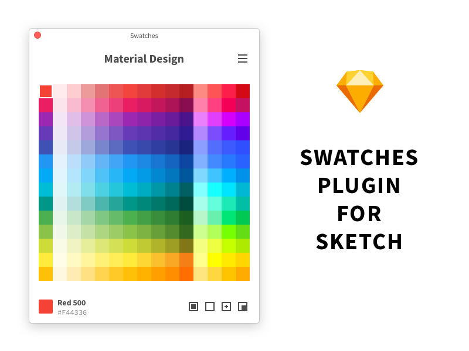

# Swatches for Sketch

A swatches plugin for Sketch, include Material Design, Open Color, RAL, TOYO, Pantone and more.

## Installation

1. Download [master.zip](https://github.com/Ashung/Sketch_Swatches/archive/master.zip), unzip it.
2. Double-click the "Swatches.sketchplugin".

## Swatches Library

- Google Material Design
- Apple iOS
- Open Color
- IBM Design Colors
- Named Web Colors
- Web Safe Colors
- Name Colors
- Brand Colors
- RAL
- TOYO
- DIC
- Focoltone
- Trumatch
- COPIC
- Pantone PMS
- Pantone Formula Guide Solid Coated
- Pantone Formula Guide Solid Uncoated
- Pantone Formula Guide Solid Coated 112 New Colors
- Pantone Formula Guide Solid Uncoated 112 New Colors
- Pantone Color Bridge Coated
- Pantone Color Bridge Uncoated
- Pantone Color Bridge Coated 112 New Colors
- Pantone Color Bridge Uncoated 112 New Colors
- Pantone CMYK Coated
- Pantone CMYK Uncoated
- Pantone Metallic Coated
- Pantone Premium Metallic Coated
- Pantone Extended Gamut Coated
- Pantone Pastels & Neons Coated
- Pantone Pastels & Neons Uncoated
- Pantone Fashion Home (cotton)
- Pantone Fashion Home (cotton) new
- Pantone Fashion Home (paper)
- Pantone Fashion Home (paper) new
- 中国の伝統色
- 日本の伝統色

## License

CC-BY-SA 4.0

## Donate

Donate [$1.00](https://www.paypal.me/ashung/1)  [$2.00](https://www.paypal.me/ashung/2)  [$5.00](https://www.paypal.me/ashung/5) via PayPal.

通过 [微信](http://ashung.github.io/Automate-Sketch/css/donate_wechat_rmb_10.png) 或 [支付宝](http://ashung.github.io/Automate-Sketch/css/donate_alipay_rmb_10.png) 打赏。