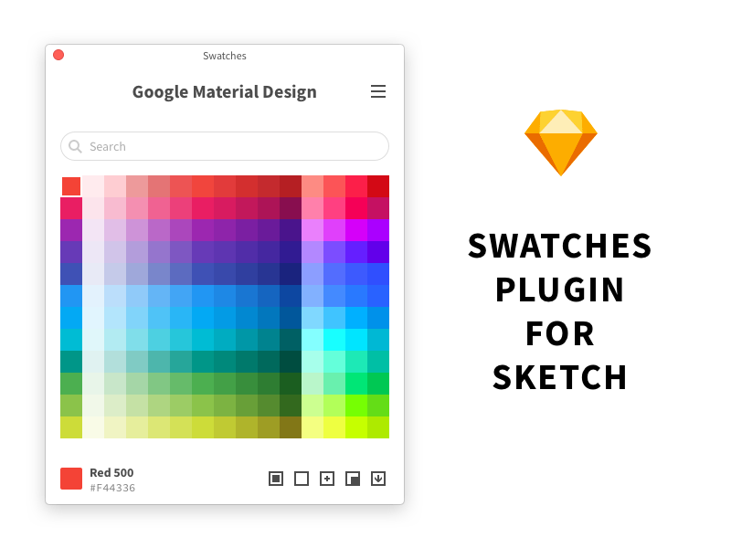

# Swatches for Sketch

**This project is no longer maintenance**. Use system color picker (run "View" - "Show Colors") instead, and use [Import Colors](https://github.com/Ashung/import-colors-sketch) plugin to convert swatches file from Photoshop and Illustartor to .clr file.

All swatches files inside this plugin in clr format, can download [here](swatches.zip).

----

A swatches plugin for Sketch.

## Installation

- Search "Swatches" from [Sketch Runner](http://sketchrunner.com/),  [Sketchpacks](https://sketchpacks.com/) or [Sketch Toolbox](http://sketchtoolbox.com/).
- Download [master.zip](https://github.com/Ashung/Sketch_Swatches/archive/master.zip), unzip it, then double-click the "Swatches.sketchplugin".

## Swatches Library

- Google Material Design
- Apple iOS
- Microsoft Windows
- Ant Design Colors
- Shopify Polaris Design
- Atlassian Design
- Open Color
- IBM Design Colors
- Named Web Colors
- Web Safe Colors
- Flat UI Colors

## License

Apache 2.0

## Donate

[Buy me a coffee](https://www.buymeacoffee.com/ashung) or donate [$2.00](https://www.paypal.me/ashung/2)  [$5.00](https://www.paypal.me/ashung/5) [$10.00](https://www.paypal.me/ashung/10)  via PayPal.

[使用支付宝与微信打赏](https://ashung.github.io/donate.html)
